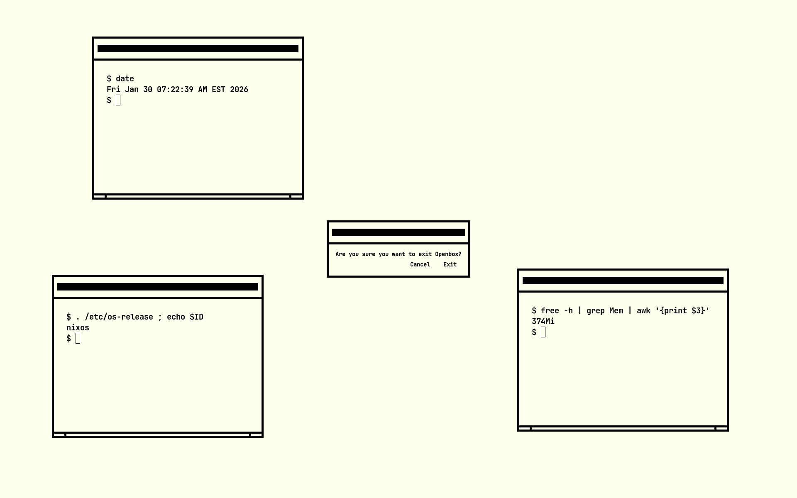

# minimal openbox

_very_ minimal openbox configuration



| category       | stack     |
| -------------- | --------- |
| display server | `xorg`    |
| window manager | `openbox` |
| terminal       | `xterm`   |
| browser        | `w3m`     |

largely inspired by [retro](http://github.com/chocolateBread799/retro)

# usage

1. import `nixosModules.minimal-openbox`, example:

   ```nix
   {
     inputs = {
       nixpkgs.url = "github:nixos/nixpkgs/nixos-unstable";

       # add this flake as an input
       minimal-openbox = "github:sotormd/minimal-openbox";
       minimal-openbox.inputs.nixpkgs.follows = "nixpkgs";
     };

     outputs = inputs: {
       nixosConfigurations.nixos = inputs.nixpkgs.lib.nixosSystem {
         specialArgs = { inherit inputs; };
         modules = [
           # import the module
           inputs.minimal-openbox.nixosModules.minimal-openbox

           # your other modules here
           ./configuration.nix
           # ...
         ];
       };
     };
   }
   ``
   ```

2. start openbox

   ```bash
   startx
   ```
